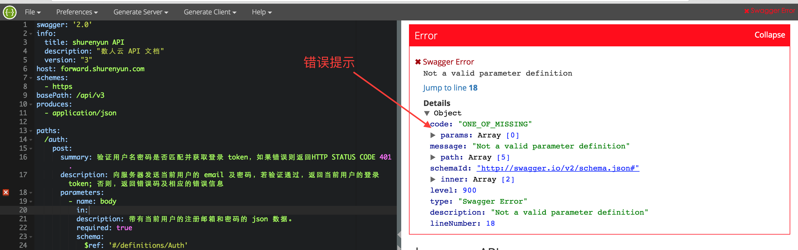
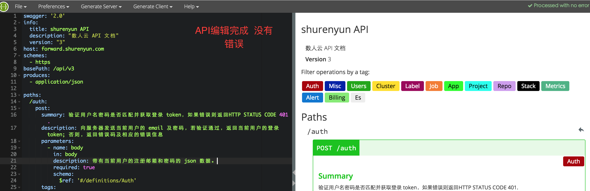
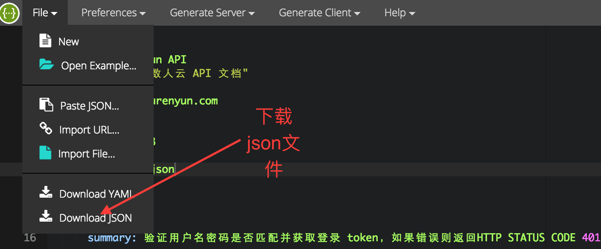

API-DOC 工具 swagger部署和使用文档

### 部署 swagger
1. 准备镜像: </br>
   ```
     docker pull mydock/swagger-editor
     
     docker pull schickling/swagger-ui
   ```
2. 启动服务
     ```
     docker run -p 8081:8080 --name=apieditor -d mydock/swagger-editor
     
     docker run -p 80:80 --name=apidoc -e
     API_URL=https://raw.githubusercontent.com/Dataman-Cloud/omega-api-docs/master/api-doc.json  -d schickling/swagger-ui
     ```
     第一个服务是用来在线编辑yaml文档的, 第二个展示服务需要的环境变量 *API_URL* 连接到json文件的地址
3. 使用swagger
   http://$DOCKER_HOST:8081 就会来到编辑页面, 如果之前有编辑过的yaml文档,则将文档拷贝到swagger左侧在原有文档的基础上继续编辑.
   编辑过程中如果yaml文档有语法错误,swagger在右侧会有实时提示, 编辑完一个API之后如果右侧提示有错误需要修改文档知道错误消失为止, 建议编辑完一个API接口后进行一次保存
   
   
4. 保存文档
   需要注意的一点是, 我们在 swagger-editor中编辑的是yaml文档, 但是在swagger-ui中展示的需要 json文档, 但是swagger-editor会自动根据yaml文档生成json文档
   编辑完后可以再 swagger-editor 的左上角选择 download json. 现在完成之后可以将json 文件提交,通过swagger-ui 可以查看最新编辑的文档. 为了方便协作编辑和后序修改的需要建议在提交json文档的同事也提交一份 yaml格式的文档
   
