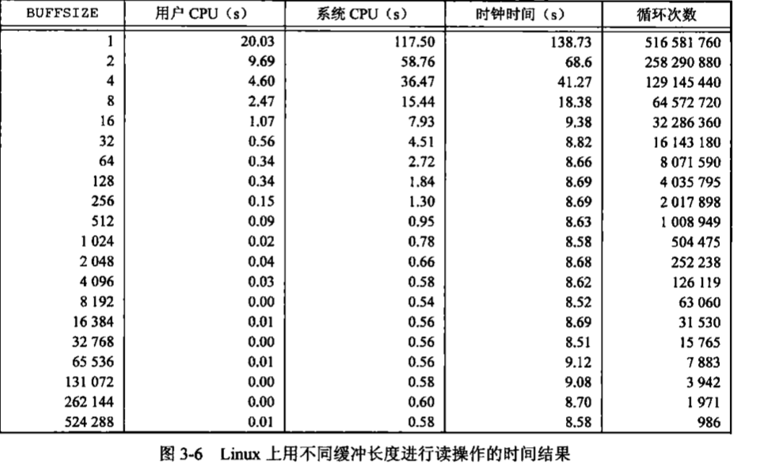

### 文件I/O(二)

**函数 lseek** <br>
每打开一个文件都有一个与其相关联的"当前文件偏移量"(current file offset). 它通常是一个非负整数, 用以度量从文件开始处计算的字节数. 通常读,写操作都是从当前文件偏移量处开始,并使偏移量增减所读写的字节数.按照系统默认的情况,当打开一个文件时,除非指定O_APPEND选项,否则该偏移量被设置为0. <br>

可以调用 lseek 显示地为一个打开文件设置偏移量.
***
    off_t lseek(int fd, off_t offset, int whence);
***
参数说明:
* 若whence是SEEK_SET,则将该文件的偏移量设置为距文件开始处offset个字节.
* 若whence是SEEK_CUR,则将该文件的偏移量设置为当前值加offset,offset可为正或负
* 若whence是SEEK_END,则将该文件的偏移量设置为文件长度加offset,offset可为正或负.<br>

若lseek执行成功, 则返回新的文件偏移量. 如果文件描述符指向的是一个管道,FIFO或网络套接字,则lseek返回-1,并将errno设置为ESPIPE. <br>
通常,文件的当前偏移量应当是一个非负整数,但是某些设备也可能允许负的偏移量.但是对于普通文件,其偏移量必须是一个非负值.因为偏移量可能是负值,所以在比较lseek的返回值时应当谨慎,不要测试它是否小于0,而要测试它是否等于-1. <br>
lseek仅将当前的文件偏移量记录在内核中,它并不引起任何I/O操作.然后,该偏移量用于下一个读或写操作. <br>
文件偏移量可以大于文件的当前长度,在这种情况下,对该文件的下一次写将加长该文件,并在文件中构成一个空洞,这一点事允许的.位于文件中但没有写过的字节都被读为0. <br>
文件中的空洞并不要求在磁盘上占用存储区,具体处理方式与文件系统的实现有关,当定位到超出文件尾端之后写时,对于新写的数据需要分配磁盘块,但对于原文件尾端和新开始写位置之间的部分则不需要分配磁盘块.

**函数 read**: 调用read函数从打开文件中读取数据.
***
    ssize_t read(int fd, void *buf, size_t nbytes);
    返回值: 读到的字节数, 若已到文件尾,返回0; 若出错,返回-1
***
如果read成功,则返回读到的字节数.如以达到文件的尾端,则返回0. <br>
一下情况下实际读到的字节数可能少于要求读的字节数:
* 读普通文件时,在读到要求字节之前已到达文件尾端. 例如,若到达文件尾端之前有30个字节,而要求读100个字节,则read返回30.下一次在调用read时,他将返回0(文件尾端).
* 当从终端设备读时,通常一次最多读一行.
* 当从网络读时,网络中的缓冲机制可能造成返回值小于所要求读的字节数.
* 当从管道会FIFO读时,如若管道包含的字节少于所需的数量.那么read将只返回实际可用的字节数.
* 当从某些面向记录的设备(如磁带)读时,一次最多返回一个记录.
* 当一信号造成中断,而已经读取了部分数据量时.


**函数 write**: 调用write函数向打开文件写数据
***
    ssize_t write(int fd, const void *buf, size_t nbytes);
    返回值: 若成功返回已写的字节数;若出错,返回-1.
***
对于普通文件,写操作从文件的当前偏移量处开始.如果打开该文件时,指定了O_APPEND选项,则在每次写操作之前,将文件偏移量设置在文件的当前结尾处.再一次写成功开始后,该文件偏移量增加实际写的字节数.

**I/O 效率**
```
#include "apue.h"

#define	BUFFSIZE	4096

int
main(void)
{
	int		n;
	char	buf[BUFFSIZE];

	while ((n = read(STDIN_FILENO, buf, BUFFSIZE)) > 0)
		if (write(STDOUT_FILENO, buf, n) != n)
			err_sys("write error");

	if (n < 0)
		err_sys("read error");

	exit(0);
}
```
上面的程序只是用read和write函数复制一个文件. <br>
关于该程序需要注意的是:
* 它从标准输入读,写至标准输出.这就假定在执行本程序之前,这些标准输入,输出已由shell安排好.所有常用的UNIX系统shell都提供一种方法,它在标准输入上打开一个文件用于读,在标准输出上创建(或重写)一个文件,这使得程序不必打开输入和输出文件,并允许用户利用shell的I/O重定向功能.
* 考虑到进程终止时,UNIX系统内核会关闭进程的所有打开的文件描述符,所以此程序并不关闭输入和输出文件.
* 对UNIX内核而言,文本文件和二进制代码文件并无区别,所以本程序对这两种文件都有效.

在这个程序中 BUFFSIZE 的值决定了拷贝文件的效率.下图显示了用20种不同的缓冲长度读 516581760字节的文件所得到的结果. 在上面的程序中其标准输出被重定向到/dev/null上.此测试所用的文件系统是Linux ext4文件系统,其磁盘块长度为4096字节(磁盘快长度由st_blksize表示), 这也证明了下图中系统CPU时间的几个最小值差不多出现在BUFFSIZE为4096及以后的位置,继续增加缓冲区长度对此几乎没有影响. <br>


注: 时间值
***
    历史上,UNIX系统使用过两种不同的时间值.
    (1) 日历事件. 改值是自协调时间时(Coordinated Universal TIme, UTC) 1970年1月1日 00:00:00这个特定时间以来所经过的秒数累计值(早期的手册称UTC为格林尼治标准时间.
    这些时间值可用于记录文件最近一次的修改时间等. 系统基本数据类型time_t用于保存这种时间值.
    (2) 进程时间. 也被称为CPU时间.用以度量进程使用的中央处理器资源.进程时间以时钟每次滴答计算.每秒曾取为50, 60或100 个时钟滴答.
    当度量一个进程的执行时间是.UNIX系统为一个进程维护了3个进程时间值:
    * 时钟时间: 从进程开始运行到结束,时钟走过时间,这其中包含了进程在阻塞和等待状态的时间.
    * 用户CPU时间: 用户的进程获得CPU资源后,在用户态执行的时间.
    * 系统CPU时间: 用户进程获得CPU资源后,在内核态的执行时间. 
    注意: 用户CPU时间和系统CPU时间之和为CPU时间,即命令占用CPU执行的时间总和.实际时间要远大于CPU时间,因为往往在执行一条命令时,系统还要处理其他任务.
***
更多关于用户态程序计时方式可以参考 [Linux用户态程序计时方式详解](http://os.51cto.com/art/201407/445853.htm)


大多数文件系统为改善性能都采用某种预读(read ahead)技术.当检测到正进行顺序读取时,系统师徒读入比应用所要求的更多数据,并假想应用很快就会读这些数据. 预读的效果可以从上图中看出缓冲区长度小至32字节的时钟时间与拥有较大缓冲区的时钟时间几乎一样
